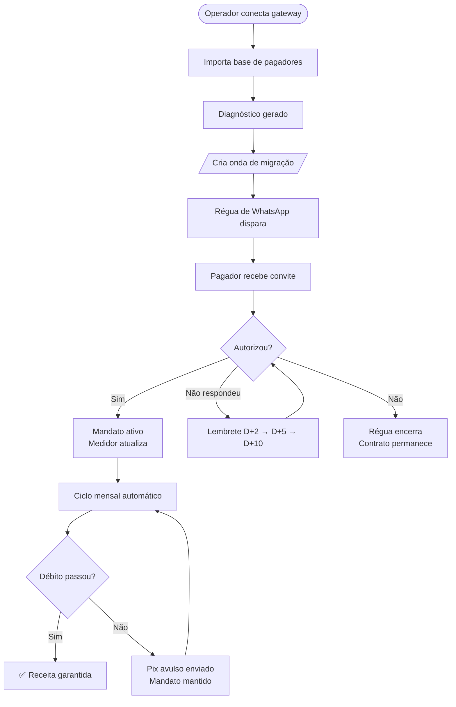

<div align="center">

# ⚡ Pulse

### Migre sua base recorrente para Pix Automático — sem perder um cliente no caminho

[](https://www.typescriptlang.org/)
[](https://nextjs.org/)
[](https://supabase.com/)
[](./PLAN.md)

</div>

---

## O problema

Todo negócio de mensalidade no Brasil tem a mesma conta:

| Método atual | Taxa | Impacto em R$ 100 k/mês |
|---|:---:|:---:|
| Cartão recorrente | 2% a 3,5% | R$ 2.000 a R$ 3.500 **saindo todo mês** |
| Boleto | R$ 2 a R$ 4 por título | R$ 600 a R$ 1.200 + inadimplência |
| **Pix Automático** | **≈ R$ 0,01** | **≈ R$ 30** |

O Pix Automático existe desde junho de 2025. A adesão entre quem efetivamente recebe o convite é de **73%**. O gargalo não é tecnológico: **entre a API do gateway e o pagador que autorizaria, não há ninguém.**

Pulse fecha essa lacuna.

---

## O que o Pulse faz

```
Pulse faz três coisas e apenas três.
```

### 1 · Diagnóstico — "quanto estou perdendo hoje?"

O operador conecta o gateway (Asaas ou Efí Bank), importa a base de pagadores
e em minutos recebe um relatório com:

- MRR total, custo atual por método e projeção de economia em 3 cenários (50 / 70 / 90% de migração)
- Perfil de risco da base: quem está inadimplente, quem venceu no último mês, quem nunca pagou em dia
- PDF pronto para compartilhar com sócios e apresentar ao conselho

> *O relatório de diagnóstico é o material de marca mais importante do negócio — é a prova antes da venda.*

---

### 2 · Ondas — "como faço 400 pessoas trocarem de método?"

O operador cria uma **onda de migração**: seleciona um filtro da base
(método de pagamento, valor, histórico de falhas), define a régua e ativa.

```
Onda criada → régua dispara automaticamente por WhatsApp
```

**Régua padrão da onda:**

```
D0   ──▶  Convite inicial com link personalizado
D+2  ──▶  Lembrete curto (quem não abriu)
D+5  ──▶  Responde à dúvida não feita ("o que estou autorizando?")
D+10 ──▶  Último aviso — transparente, sem pressão
```

As mensagens são adaptadas ao segmento do negócio: uma academia fala em "mensalidade e aluno", uma clínica fala em "plano e paciente", um condomínio fala em "taxa condominial e morador".

---

### 3 · Autorização — a jornada do pagador

O pagador recebe uma mensagem de WhatsApp assinada pelo negócio (não pela Pulse).
O link abre uma página com a identidade visual do cliente — logo, cor, nome.

```
WhatsApp → Link personalizado → Página de autorização
                                        │
                              ┌─────────┴──────────┐
                              │                    │
                           Celular              Desktop
                              │                    │
                        Deep link direto      QR Code + instrução
                        no app do banco
                              │
                     Pagador autoriza
                     no próprio banco
                              │
                     ✅ Autorização confirmada
                     Pulse registra, régua para,
                     medidor de economia atualiza
```

O pagador **não sai do app do banco** para autorizar. Não há cadastro, não há senha Pulse. O consentimento fica no banco — e pode ser cancelado pelo próprio banco quando quiser.

---

### Ciclo mensal — depois da migração

```
D-3  ──▶  Aviso pré-débito  ("vai sair R$ 150,00 no dia 15 — nenhuma ação necessária")
D0   ──▶  Cobrança criada no gateway
          │
          ├── ✅ Pago  →  Registro + próximo ciclo agendado
          │
          └── ❌ Falhou  →  Pix avulso enviado por WhatsApp
                           (mantém a autorização viva, não cancela o mandato)
```

Se a autorização quebrar (pagador cancelou no banco), o Pulse avisa no mesmo dia
e a régua recomeça automaticamente para aquele contrato.

---

## Fluxo completo



---

## Para quem é o Pulse

| Segmento | Rótulo do pagador | Economia típica |
|---|---|---|
| 🏋️ Academia / Studio | Aluno | R$ 2.000–8.000 / mês |
| 🏥 Clínica / Consultório | Paciente | R$ 3.000–15.000 / mês |
| 🏢 Condomínio | Morador | R$ 1.500–6.000 / mês |
| 📚 Escola / Curso | Aluno | R$ 4.000–20.000 / mês |
| 🎾 Clube / Associação | Associado | R$ 2.000–10.000 / mês |

---

## Gateways suportados

| Gateway | Status | Notas |
|---|---|---|
| **Asaas** | ✅ Produção | Primeiro adapter |
| **Efí Bank** | ✅ Implementado | Pix Automático padrão BACEN |

A interface `GatewayAdapter` é agnóstica de provedor — adicionar um novo gateway
não altera nenhum código de negócio.

---

## Três princípios que não negociamos

**1 · O pagador nunca é chamado de devedor**
Mesmo quando a cobrança falha, a mensagem é informativa — não acusatória.
Produto financeiro vendido com pressão perde a credibilidade de que depende.

**2 · Quem aparece para o pagador é o negócio, não a Pulse**
A página de autorização tem o logo e a cor do cliente. A Pulse assina discretamente no rodapé.

**3 · Zero lógica sensível no lado do cliente**
Todas as queries de dados são Server Components ou Server Actions. Credenciais de gateway
são criptografadas (AES-GCM) e descriptografadas apenas no servidor, nunca expostas ao browser.

---

## Stack técnica

| Camada | Tecnologia |
|---|---|
| Framework | Next.js 16 (App Router) · React 19 |
| Autenticação | Clerk (multi-tenant por organização) |
| Banco | Supabase (Postgres + RLS por JWT) |
| Estilos | Tailwind v4 · tokens próprios |
| Tipografia | Archivo · Inter · JetBrains Mono |
| Gateways | Asaas · Efí Bank |
| Mensageria | Z-API (WhatsApp) |
| Testes | Vitest |
| Deploy | Vercel (cron a cada minuto) |

---

## Começar a desenvolver

```bash
npm install
cp .env.example .env.local   # preencher as variáveis
npm run dev                  # http://localhost:3000
```

```bash
npm run typecheck   # tsc --noEmit
npm run lint        # eslint
npm test            # vitest
npm run build       # build de produção
```

### Variáveis de ambiente necessárias

```env
# Clerk
NEXT_PUBLIC_CLERK_PUBLISHABLE_KEY=
CLERK_SECRET_KEY=

# Supabase
NEXT_PUBLIC_SUPABASE_URL=
NEXT_PUBLIC_SUPABASE_ANON_KEY=
SUPABASE_SERVICE_ROLE_KEY=

# Criptografia de credenciais (32 bytes em base64)
APP_ENCRYPTION_KEY=

# URL pública (usada nos links de autorização)
NEXT_PUBLIC_APP_URL=https://seu-dominio.com
```

### Migrations

```bash
# Aplicar todas as migrations em ordem
supabase db push

# ou via CLI local
supabase db reset   # aplica migrations + seed
```

### Rede (desenvolvimento)

O Clerk exige acesso de saída a dois hosts — sem eles nenhuma página abre:

- `<sua-instância>.clerk.accounts.dev`
- `api.clerk.com`

---

## Estrutura

```
src/
├── app/
│   ├── (marketing)/          # landing pública
│   ├── (auth)/               # entrar · cadastrar
│   ├── (onboarding)/         # conectar gateway · importar base
│   ├── (app)/                # painel autenticado
│   │   ├── dashboard/        # diagnóstico + medidor de migração
│   │   ├── pagadores/        # base de pagadores
│   │   ├── ondas/            # criação e acompanhamento de ondas
│   │   ├── atencao/          # fila de risco
│   │   └── configuracoes/    # organização · gateway · mensagens · API
│   ├── autorizar/[token]/    # página pública do pagador
│   └── api/
│       ├── webhooks/         # Asaas · Efí · Clerk · Z-API
│       ├── cron/tick/        # worker de jobs (1 min)
│       └── cron/daily/       # avisos e cobranças (08h UTC)
└── lib/
    ├── gateways/             # adapters Asaas + Efí
    ├── messaging/            # Z-API + templates por nicho
    ├── jobs/                 # fila de jobs + handlers
    └── domain/               # diagnóstico · ondas · cadência · medidor
```

---

## Documentação interna

| Documento | Conteúdo |
|---|---|
| [PLAN.md](./PLAN.md) | Plano de implementação completo + desvios confirmados da stack |
| [docs/BRAND_BOOK.md](./docs/BRAND_BOOK.md) | Brand book completo (estratégia, identidade, tom) |
| [docs/ANALISE-MARCA-PLANO.md](./docs/ANALISE-MARCA-PLANO.md) | Conflitos entre marca e plano técnico |

---

<div align="center">

**Pulse** · Plataforma de migração para Pix Automático
Construído no Brasil para negócios brasileiros

</div>
